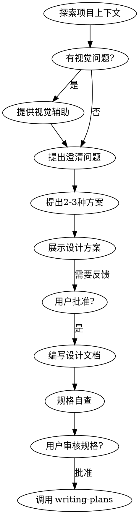

# Agent Skills 介绍

本文档介绍 SAST Agent 可用的所有技能（Skills），帮助你在不同场景下选择合适的工具。

---

## 目录

- [belos-street](#belos-street) - 个人编码规范
- [brainstorming](#brainstorming) - 头脑风暴与设计
- [bun](#bun) - Bun 运行时
- [langchain](#langchain) - AI Agent 框架
- [react](#react) - React 基础
- [react-best-practices](#react-best-practices) - React 最佳实践
- [writing-plans](#writing-plans) - 实现计划编写

---

## belos-street

**个人编码规范与最佳实践**

提供统一的代码风格指南，帮助保持项目一致性。

### 核心功能

| 模块 | 说明 |
|------|------|
| Naming Conventions | 文件、变量、函数、接口的命名规范 |
| Code Organization | 代码组织方式和目录结构 |
| Code Style | 代码风格配置和格式化规则 |
| Testing Philosophy | 测试理念和测试策略 |
| LLM Coding Guidelines | LLM 辅助编码指南 |

### 使用场景

- 需要遵循统一编码规范时
- 查阅命名风格建议时
- 了解项目代码组织方式时

### 快速参考

| 类型 | 风格 | 示例 |
|------|------|------|
| 文件/目录 | kebab-case | `user-profile.ts` |
| React/Vue 组件 | kebab-case | `user-card.tsx` |
| 函数/变量 | camelCase | `fetchUserData` |
| 接口/类型 | PascalCase | `UserInfo` |
| 常量 | UPPER_SNAKE_CASE | `MAX_RETRY_COUNT` |

---

## brainstorming

**头脑风暴与设计探索**

在任何创意工作之前使用，包括创建功能、构建组件、添加功能或修改行为。在实现之前探索用户意图、需求和设计。

### 核心原则

> **重要**: 在完成设计并获得用户批准之前，**不要**调用任何实现技能、编写代码或采取任何实现行动。

### 工作流程



### 使用场景

- 创建新功能或模块时
- 构建新组件时
- 添加新功能或修改行为时
- 需要明确需求和设计方案时

### 关键检查点

1. 探索项目上下文
2. 提供视觉辅助（如有视觉问题）
3. 逐一提问澄清问题
4. 提出 2-3 种方案及权衡
5. 展示分节设计方案
6. 编写设计文档并保存
7. 规格自查
8. 用户审核后调用 writing-plans

---

## bun

**Bun 现代 JavaScript 运行时**

快速、现代的 JavaScript 运行时和工具包，是 Node.js 的替代方案。

### 核心特性

| 特性 | 说明 |
|------|------|
| Native TypeScript | 直接运行 .ts/.tsx 文件，无需转译 |
| Built-in Tools | 包管理器、测试、打包工具内置 |
| Node.js Compatible | 兼容大部分 Node.js 生态 |
| Web APIs | 原生 fetch, WebSocket, ReadableStream |
| Bun.serve() | 高性能 HTTP 服务 |
| Bun.file() | 简化文件操作 |
| bun:test | 零配置测试框架 |

### 使用场景

- 使用 Bun 运行时运行 JavaScript/TypeScript 代码
- 使用 Bun 的包管理器安装依赖
- 编写高性能 HTTP 服务
- 使用 Bun 内置测试框架编写测试

### 重要区别于 Node.js

```ts
// ✅ Bun 写法
Bun.serve({ port: 3000, fetch: (req) => new Response('Hi') })

// ❌ 避免 Node.js 写法
http.createServer()

// ✅ Bun 文件操作
const file = Bun.file('./data.json')
const content = await file.text()

// ✅ Bun 环境变量
console.log(Bun.env.NODE_ENV)
```

---

## langchain

**LangChain AI Agent 框架**

用于构建 AI Agent 和 LLM 应用的框架，支持工具、内存和流式输出。

### 核心组件

| 组件 | 说明 | 参考文档 |
|------|------|----------|
| Agents | 核心 Agent 架构 | agents-basics.md |
| Models | 模型集成 (OpenAI, Anthropic 等) | models-integration.md |
| Messages | 消息格式和对话结构 | messages-format.md |
| Tools | 工具定义和动态工具选择 | agents-tools.md |
| Memory | 短期和会话内存 | memory-short-term.md |
| Streaming | 实时响应的流式输出 | streaming-output.md |
| Structured Output | 从 LLM 提取结构化数据 | structured-output.md |

### 中间件

| 中间件 | 说明 | 参考文档 |
|--------|------|----------|
| Middleware Overview | 中间件架构和模式 | middleware-overview.md |
| Human-in-the-Loop | 为 Agent 添加人工干预 | middleware-human-in-loop.md |

### 额外功能

| 功能 | 说明 | 参考文档 |
|------|------|----------|
| Prompt Templates | 可复用提示模板 | prompt-templates.md |
| RAG Basics | 检索增强生成 | rag-basics.md |
| Error Handling | 生产环境错误处理模式 | error-handling.md |

### 使用场景

- 构建 AI Agent 应用
- 集成 LLM 到现有系统
- 需要工具调用能力的 AI 应用
- 需要会话记忆的对话系统
- 流式输出用户界面

### 基础示例

```python
from langchain.agents import create_agent

def get_weather(city: str) -> str:
    """Get weather for a given city."""
    return f"It's always sunny in {city}!"

agent = create_agent(
    model="claude-sonnet-4-6",
    tools=[get_weather],
    system_prompt="You are a helpful assistant",
)
```

---

## react

**React 基础与核心概念**

React Hooks、TypeScript、组件模式和现代 React 最佳实践的基础参考。

### 核心主题

| 主题 | 说明 | 参考文档 |
|------|------|----------|
| Hooks | useState, useEffect, useCallback, useMemo 等 | hooks.md |
| Component Patterns | 函数组件、props、children、组合模式 | components-patterns.md |
| Advanced Features | Suspense, Error Boundary, Lazy loading, Context | advanced-features.md |

### 核心原则

- 优先使用 TypeScript
- 使用函数组件和 Hooks
- 优先组合而非继承
- 合理使用 useMemo 和 useCallback
- 使用 Context 或组合避免 prop drilling

### 使用场景

- 编写 React 组件、hooks、context 时
- 使用 Suspense/ErrorBoundary/Lazy loading 时
- 需要了解 React 核心概念时

### 快速参考

```tsx
interface Props {
  title: string
  count?: number
  onUpdate: (value: string) => void
}

export function MyComponent({ title, count = 0, onUpdate }: Props) {
  const [value, setValue] = useState<string>('')

  const doubled = useMemo(() => count * 2, [count])

  const handleClick = useCallback(() => {
    onUpdate(value)
  }, [onUpdate, value])

  useEffect(() => {
    console.log('Component mounted')
    return () => console.log('Cleanup')
  }, [])

  return <div>{title} - {doubled}</div>
}
```

---

## react-best-practices

**React 19 最佳实践**

深入探讨 React 开发中的常见陷阱和性能优化，是 react 技能的补充。

### 主题分类

#### State & Hooks

| 主题 | 说明 |
|------|------|
| hooks-state-update-batching | setState 调用未按预期批处理 |
| hooks-async-state-updates | setState 后立即读取状态 |
| hooks-functional-updates | 新状态依赖前一个状态 |
| hooks-initial-state-lazy | 昂贵的初始状态每次渲染都运行 |
| hooks-state-not-mutated-directly | 直接修改状态导致 bug |
| hooks-object-state-spread | 更新对象状态丢失其他属性 |

#### useEffect

| 主题 | 说明 |
|------|------|
| useeffect-empty-deps | 效果仅在挂载时运行一次 |
| useeffect-missing-dependencies | 缺失依赖导致过时闭包 |
| useeffect-cleanup-function | 忘记清理副作用 |
| useeffect-async-pattern | 使用 async 函数作为效果 |
| useeffect-conditional-effects | 条件性 useEffect 调用导致错误 |

#### Performance

| 主题 | 说明 |
|------|------|
| performance-memo | 使用 React.memo |
| performance-usecallback | 使用 useCallback |
| performance-usememo | 使用 useMemo |
| performance-code-splitting | 代码分割 |
| performance-virtualization | 列表虚拟化 |

#### Components

| 主题 | 说明 |
|------|------|
| component-props-immutable | 直接修改 props |
| component-children-prop | 向组件传递内容 |
| component-naming-convention | 组件命名规范 |
| component-default-props | 设置默认 prop 值 |
| component-prop-types | Prop 类型验证 |

#### Context

| 主题 | 说明 |
|------|------|
| context-avoid-prop-drilling | 避免 prop drilling |
| context-performance-optimization | 优化 Context 性能 |
| context-default-values | 提供默认值 |
| context-multiple-contexts | 使用多个 contexts |

#### Custom Hooks

| 主题 | 说明 |
|------|------|
| custom-hooks-naming-convention | 命名规范 |
| custom-hooks-composition | 组合 hooks |
| custom-hooks-side-effects | 清理副作用 |
| custom-hooks-readonly-state | 返回只读状态 |

#### Refs

| 主题 | 说明 |
|------|------|
| useRef-vs-state | useRef vs useState |
| useRef-dom-access | 访问 DOM 元素 |
| useRef-forward-ref | 转发 refs |
| useRef-cleanup | 清理 refs |
| useRef-persistence | 持久化值 |

#### Event Handlers

| 主题 | 说明 |
|------|------|
| event-handlers-naming-convention | 命名规范 |
| event-handlers-inline | 避免内联处理器 |
| event-handlers-binding | 正确绑定处理器 |
| event-handlers-propagation | 控制事件传播 |
| event-handlers-cleanup | 清理事件监听器 |

#### Suspense

| 主题 | 说明 |
|------|------|
| suspense-lazy-loading | 懒加载 |
| suspense-data-fetching | 数据获取 |
| suspense-error-boundaries | 错误边界 |
| suspense-fallback | Fallback UI |
| suspense-concurrent-features | 并发特性 |

#### TypeScript

| 主题 | 说明 |
|------|------|
| typescript-component-props | 组件 props 类型 |
| typescript-hooks | Hooks 类型 |
| typescript-generics | React 泛型 |
| typescript-utility-types | 实用类型 |
| typescript-best-practices | 最佳实践 |

#### Animation

| 主题 | 说明 |
|------|------|
| animation-css-transitions | CSS 过渡 |
| animation-css-animations | CSS 动画 |
| animation-framer-motion | Framer Motion |
| animation-performance | 性能优化 |

### 使用场景

- 处理 React 常见问题时查阅
- 深入了解 React 最佳实践时
- 性能优化场景
- TypeScript + React 类型问题

---

## writing-plans

**实现计划编写**

在有规格或需求的多步骤任务之前使用，编写详细的实现计划。

### 核心原则

- 假设工程师对代码库零基础、品味一般
- 文档化一切需要知道的信息
- 提供完整的计划作为小块任务
- 遵循 DRY、YAGNI、TDD 原则
- 频繁提交

### 计划文件位置

```
docs/superpowers/plans/YYYY-MM-DD-<feature-name>.md
```

### 计划结构

```markdown
# [功能名称] 实现计划

**Goal:** [一句话描述构建内容]
**Architecture:** [2-3 句方法描述]
**Tech Stack:** [关键技术和库]

---

## 文件结构

[列出将要创建或修改的文件及各自职责]

---

## 任务分解

### Task 1: [组件名称]

**Files:**
- Create: `path/to/file.py`
- Modify: `path/to/existing.py:123-145`
- Test: `tests/path/test.py`

- [ ] Step 1: 编写失败的测试
- [ ] Step 2: 运行测试确认失败
- [ ] Step 3: 编写最小实现
- [ ] Step 4: 运行测试确认通过
- [ ] Step 5: 提交
```

### 任务粒度

每个步骤应该是一个动作（2-5 分钟）：
- "编写失败的测试" - 步骤
- "运行确认失败" - 步骤
- "编写最小实现" - 步骤
- "运行确认通过" - 步骤
- "提交" - 步骤

### 使用场景

- 从 brainstorming 过渡到实现阶段
- 需要详细的任务分解时
- 需要明确文件和职责时
- 遵循 TDD 方式开发时

---

## 技能调用流程

```
用户请求
    │
    ▼
┌─────────────────┐
│  brainstorming  │ ← 首先调用，设计探索
└────────┬────────┘
         │ 批准后
         ▼
┌─────────────────┐
│  writing-plans │ ← 编写实现计划
└────────┬────────┘
         │ 计划就绪
         ▼
    开始实现
         │
         ├── React 项目 → react / react-best-practices
         ├── Bun 运行时 → bun
         ├── AI Agent → langchain
         └── 编码规范 → belos-street
```

---

## 技能索引表

| 技能 | 触发场景 | 关键标签 |
|------|----------|----------|
| belos-street | 编码规范、命名风格 | conventions, best-practices |
| brainstorming | 创意、设计、需求探索 | creative, design |
| bun | Bun 运行时相关 | javascript, runtime, bun |
| langchain | AI Agent、LLM 应用 | llm, ai, agent |
| react | React 基础 | react, hooks, components |
| react-best-practices | React 最佳实践、性能优化 | react, performance, hooks |
| writing-plans | 实现计划、任务分解 | planning, implementation |
